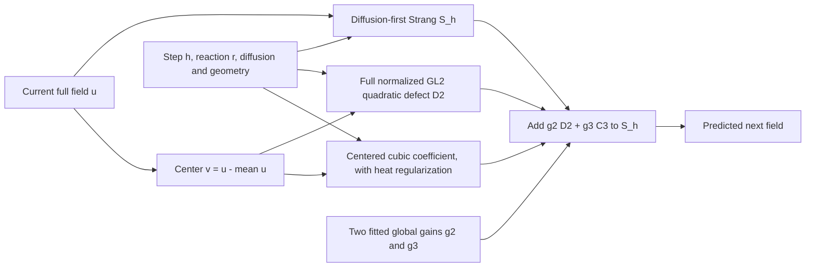

# Advance: a prospective test of cheap interaction shape, credible neural controls, and new formulations

**Research question.** Can a cheap additional physical interaction direction,
with or without two fitted global coefficients, improve the accuracy–cost
frontier over strong analytic rules and a fairly initialized neural residual
operator? Separately, when does unresolved-state information require history,
and can a different temporal response reduce actual work?

This is an internally frozen prospective experiment declaration, not an external
preregistration or a claim of literature novelty. The executable authority is
[`tdn.advance/v1`](../tdn/analysis/advance/protocol.py). Its hash, source identity,
selected checkpoints, field identities and validation schedule choices must seal
before fresh confirmation references are generated. Changes following inspection
of confirmation require a new declaration and fresh fields. Historical portfolio
artifacts and verdicts remain intact.

## 1. Evidence diagnosis and the protected portfolio

The preceding [native portfolio review](PORTFOLIO_FULL_REVIEW.md) supports the
following decisions. These are evidence-based motivations, not expected outcomes
being counted as new results.

| Existing evidence | What it supports | What it does not establish | Next discriminating test |
|---|---|---|---|
| Correct quadrature normalization and interactions formed before compression improved matched errors | Physical structure and normalization matter | A learned conditioner supplied the gain | Keep normalized full-output GL2/GL4 and an unchanged historical conditioner |
| The scalar-conditioned model did not meet its accuracy-gain criterion against normalized GL2 | More gain-network capacity is not yet justified | Every learned correction must fail | Add a genuinely different cubic response direction and inspect its residual span |
| Analytic quadratic+cubic correction sharply reduced a targeted same-equation residual | Missing finite-amplitude shape can matter | Its expensive nested formula is economical, or the gain is uniform | Compare the expensive formula against a derived cheap leading cubic term |
| Local FNO training remained poor relative to the DF backbone, with large mean errors | Initialization, target scale and mean handling need attribution | Superiority over the FNO paper or strong neural operators | Preserve legacy FNO and vary zero initialization, deployable scaling and mean head separately |
| Accurate schedules existed but validation-frozen choices sometimes failed to transfer | Model capacity and schedule transfer are different bottlenecks | Confirmation-informed schedules are deployable | Select schedules with batch-one validation timing and retain every absent or failed choice |
| History explained an unresolved interaction but previous histories were backward-generated | Temporal information is promising | A causal, noise-robust or inexpensive closure | Forward-only startup, deterministic-memory controls, noise and autonomous rollout |
| Accurate temporal encodings/selectors did not recover their setup/selection cost | Representation accuracy alone is insufficient | All alternative formulations are unproductive | Small rational-response and variational-flow kill tests with equal caching controls |

Three paths remain active. **A** repairs attribution and competitor opportunity.
**B** tests cheap physically derived interactions. **C** has three separately
budgeted formulation probes. Exploration receives 2,700 numerical CPU seconds
in full, divided into three 900-second units; it cannot silently consume the
comparison budget or disappear when an incremental method looks promising.

The primary contribution sought is narrow: an interpretable numerical correction
or compact fitted numerical rule that earns an accuracy or complete-call cost
advantage for a specified workload. Better representation, better fitting,
generalization, and complete solver economics are separate claims.

## 2. The equations, targets, and information available at inference

The 2D physical task remains periodic logistic reaction–diffusion on `[0,1]²`:

\[
 \partial_t u=\kappa\Delta u+r u(1-u).
\]

For the **discrete track**, the declared finite-dimensional equation is

\[
 \dot u=A_{\rm FD}u+r(u-u\odot u),
\]

where `A_FD` is the periodic central-difference diffusion generator and `⊙` is
nodal multiplication. For the **Galerkin model** used on the continuum track,

\[
 \dot u=A_Nu+r\{u-B_N(u,u)\},\qquad B_N(a,b)=P_N(ab),
\]

with spectral diffusion and dealiased projected products. Same-grid diagnostic
teachers isolate temporal/interaction error in that specified equation.
Continuum-track training and confirmation use projected spatially refined
teachers, so those errors can additionally include coarse-resolution effects.
Do not credit continuum compensation as a same-equation temporal improvement.

All core methods receive the current full field, step, diffusion coefficient,
reaction rate and domain geometry. They receive neither a future field nor a
reference-dependent inference scale. Classical and hybrid methods share the
appropriate spatial target. The inherited physical backbone is diffusion-first
Strang:

\[
 S_h(u)=H_{h/2}R_hH_{h/2}u,\qquad H_h=e^{hA}.
\]

Discrete reaction has its exact logistic flow. Galerkin reaction uses the declared
projected RK4 treatment. A continuum-track method is therefore not silently
using exact pointwise reaction for a different spatial equation.

Implementation sources: [physical operators](../tdn/analysis/frontier/numerics.py),
[advance numerical formulas](../tdn/analysis/advance/numerics.py),
[inherited interaction formulas](../tdn/analysis/roadmap/numerics.py), and
[reference preparation](../tdn/analysis/advance/data.py).

## 3. The 13-family attribution design

| Family | Label / fitted part | Output and controlled explanation |
|---|---|---|
| `df` | Theirs; frozen | Diffusion-first Strang; contained physical baseline |
| `etdrk4` | Theirs; frozen | Existing Cox–Matthews ETDRK4; credible independent numerical backbone |
| `quad2_full` | Analytic control; frozen | DF plus correctly normalized, two-node quadratic defect; no output compression |
| `quad4_full` | Analytic control; frozen | Same construction with four quadrature nodes; extra quadrature work |
| `analytic_quad_cubic` | Analytic control; frozen | Existing full nested quadratic+cubic Volterra correction; stronger expensive accuracy control |
| `quad2_conditioned` | Ours, historical control; tiny network plus global node/gain parameters | Unchanged output-compressed scalar-conditioned GL2; retains the previous model rather than silently redefining it |
| `commutator_raw` | Ours, numerical; frozen unit gains | Full GL2 plus derived leading cubic defect, without heat regularization |
| `commutator_cubic` | Ours, numerical; frozen unit gains | Full GL2 plus symmetrically heat-filtered cubic defect |
| `two_basis` | Ours; **two global scalar parameters, no neural network** | Identical GL2 and filtered cubic bases, with two bounded fitted gains |
| `fno_legacy` | Theirs, local adapted control; FNO trunk/head | Historical hybrid FNO with nonzero residual initialization and `(h/t_ref)^3` output factor |
| `fno_zero` | Theirs, adapted control; same FNO trunk/head | Zero residual head initializes exactly at DF; isolates initialization |
| `fno_scaled` | Theirs, adapted control; same FNO trunk/head | Zero head plus a state-local physical defect scale; isolates scale |
| `fno_mean` | Theirs, adapted control; trunk, centered spatial head and mean head | Same scale with independently represented mean; isolates mean/centered parameterization |

The roster is defined in [models.py](../tdn/analysis/advance/models.py). Full
execution has 62 selected instances: 14 frozen track-specific controls and 48
fitted instances including three paired seeds and the restricted secondary data
size. Parameter counts and exact selected states are measured, not inferred from
family names.

The decisive same-component comparisons are `two_basis` versus
`commutator_cubic` (fitting), `commutator_cubic` versus `commutator_raw`
(regularization), and the cubic variants versus `quad2_full` (additional shape).
GL4 and the nested cubic rule test whether extra approximation work is a better
use of computation. The historical conditioner differs in output compression and
conditioning; its comparison is a system comparison, not a pure gain-fitting
ablation. Half-normalized and input-compressed controls remain documented in the
historical portfolio rather than being rerun in every new campaign.

The primary candidate's prediction flow is:

It is still a time-step-dependent physical operator. It is not a recurrent
temporal network or an amortized latent decoder. The learned coefficients are
constant for a trained instance; state dependence resides in the physical basis
evaluations. This smaller model may be the correct research outcome if those two
coefficients suffice.

## 4. Deriving and limiting the cheap cubic correction

Let `v=u−mean(u)`, let `A` be the declared diffusion generator, and let `B` be its
quadratic product. The new raw correction is

\[
 C_{3,h}(v)=\frac{r^2h^3}{6}
 \left[B(Av,B(v,v))-2B(v,B(v,Av))
 +2B(v,AB(v,v))-AB(v,B(v,v))\right].
\]

This is the leading small-step term of the **centered-amplitude cubic DF
Volterra defect**, not a complete third-order or fourth-order solver. To see its
origin, expand the transported nested cubic interaction

\[
 H_{h-s}B(H_sv,H_{s-\tau}B(H_\tau v,H_\tau v)),
 \quad 0\le\tau\le s\le h,
\]

and subtract its DF shape
`H_(h/2) B(H_(h/2)v,B(H_(h/2)v,H_(h/2)v))`. To first order in transport time,
the four spatial shapes have coefficients `s−h/2`, `2τ−h`, `s−τ`, and `h/2−s`.
Integrating over the causal triangle and multiplying by `2r²` gives
`r²h³/6 × [1,−2,2,−1]`. Background logistic response factors equal one at zero
time and affect higher powers of `h` in this leading defect expansion.

For associative nodal multiplication the bracket simplifies to

\[
 -v^2Av+2vA(v^2)-A(v^3).
\]

Only for the unprojected differential Laplacian, where the usual Leibniz rule
applies, does this become

\[
 C_{3,h}(v)=-\frac{r^2\kappa h^3}{3}\,v|\nabla v|^2.
\]

That last expression must **not** replace the implemented finite-difference or
Galerkin formula. Finite differences do not obey the continuous Leibniz rule;
projected Galerkin multiplication is generally nonassociative:
`B(a,B(b,c)) != B(B(a,b),c)`. Losing the nesting changes the discrete equation
and can falsely remove useful high-to-low interactions.

The filtered variant evaluates

\[
 \widetilde C_{3,h}(v)=H_{h/2}\,C_{3,h}(H_{h/2}v).
\]

At fixed grid it preserves the leading `h³` coefficient and cubic amplitude
homogeneity. It is a **finite-step regularization heuristic**, not the exact
finite-step Volterra coefficient or a stiff-uniform order result. It may suppress
the very high-frequency interactions we need; the raw control measures that
tradeoff. Large `h‖A‖` is a stress regime, not a justification for the asymptotic
expansion.

The fitted rule is

\[
 \widehat u=S_hu+g_2D_{2,h}(u)+g_3\widetilde C_{3,h}(u),\qquad
 g_j=1+0.75\tanh\theta_j\in(0.25,1.75).
\]

It starts at the frozen unit-gain rule. It cannot independently rotate either
basis, reverse its sign, or acquire missing information. Unconstrained
teacher-informed development projections estimate representational headroom,
basis angles, singular values and rank; they are not deployable fitted models.
If the two response directions nearly coincide, the individual gains are weakly
identifiable even when their sum predicts accurately.

The mathematical checks include exact correction nulls at zero time, zero
reaction, zero diffusion and constant state; translation equivariance; cubic
amplitude homogeneity and centered oddness; raw-versus-nested small-step defect;
amplitude sweeps; semigroup/composition discrepancy; and perturbation response.
None of these proves positivity, long-time stability or uniform temporal order.

## 5. Giving the neural alternatives a credible bounded opportunity

All FNO variants retain the same local-plus-spectral trunk opportunity. They are
local hybrid adaptations, **not authoritative reproductions of the FNO paper**.
The experiment addresses identified optimization problems without asserting that
one bounded tuning exercise establishes globally optimal FNO performance.

For the scaled variants, the inference-time amplitude is

\[
 s(u,h)=h^3r\,\operatorname{Var}(u)\,\lambda_{\rm active}
       (r+\lambda_{\rm active}),\qquad
 \lambda_{\rm active}=-\frac{\langle v,Av\rangle_{\rm nodal}}
                              {\langle v,v\rangle_{\rm nodal}}.
\]

This is dimensionless for dimensionless carrying-capacity fields. It uses the
declared generator, field and physical parameters; its computation is charged
at inference. It is a scale, not an error estimator or certificate. On an even
Galerkin grid its implementation uses nodal weights for this heuristic feature;
the separate energy diagnostics use the physical Nyquist-aware inner product.
The scale supplies structural nulls for constant state, zero reaction, zero
diffusion and zero time.

`fno_mean` predicts a centered spatial residual plus a separate global mean
residual. The centered head has no redundant constant output bias. A zero output
head deliberately gives no trunk gradient on the first backward pass; the head
learns first and trunk gradients activate after a nonzero head update. The tests
check that actual sequence rather than requiring impossible first-step trunk
gradients.

Full training uses three paired seeds; two learning rates; the clipped default
and an unclipped, rescaled-loss control for FNOs; at most 40 tuning updates and
15 seconds per tuning trial; at most 800 final updates and 90 seconds per final
trial. The objective remains normalized squared RMS plus `0.1 × squared maximum
error`, with an explicit normalization floor. Training batch size is four.
The original initialization remains a legal validation-selected result.

A separate ten-second audit, capped at 4,000 updates, records attained versus
update-cap-censored compute. It is not silently called equal-time if the update
cap ends first. This equal-time view is a validation-based diagnostic: the full
set of equal-time checkpoints is not carried into confirmation as separate
paired arms. Main confirmation uses each model's best validation-selected trial
from the declared opportunities, potentially with different actual training
budgets; it therefore cannot establish equal-training-compute superiority.
Tiny single-example FNO overfit trials diagnose optimization but
are excluded from checkpoint selection. Logs retain actual examples, updates,
pre-clipping gradient norms, loss scaling, validation loss, optimizer time,
complete trial time, stopping reasons and selected updates. Failed or
initialization-selected fits remain in the catalog.

The primary comparison uses 64 training fields for all fitted families. Only
`two_basis` and `fno_scaled` additionally receive 16-field nested fits. This is a
secondary two-point data-efficiency comparison, not a sample-complexity theorem
or a new primary selection opportunity. Equal data, measured training compute,
the bounded equal-time audit and accuracy-qualified inference cost remain
distinct fairness views.

## 6. Fresh fields, reference uncertainty and locked comparisons

The full field bank contains 64 training, 32 validation, 64 confirmation and
eight scaling parents. Training is at 32²; confirmation pairs 32² and 64² grids.
The seeded field definitions are analytic sums of modes with an L1 amplitude
bound that keeps initial states inside `[0,1]` without clipping or grid-dependent
rescaling. Regimes include low/mixed frequencies, interacting high pairs,
broadband fields, near-Nyquist content, boundary mean, reaction stiffness and
diffusion stiffness.

Confirmation separates declared-distribution, coefficient-shift,
amplitude-shift and spectral-shift quarters. The interval-preserving amplitude
bound can limit a nominal amplitude shift; actual realized means, variance and
terms are retained. Stress labels are descriptive field constructions, not a
universal worst-case claim. The quarter with a spectral shift may replace the
original regime's mode pattern; inspect actual terms and distribution labels.

Full training times are `0.02, 0.06, 0.12`; validation includes
`0.03, 0.06, 0.12, 0.24`. Endpoint confirmation is at `0.12, 0.24`, including
primary two-step schedules `[0.04,0.08]` and `[0.08,0.16]`. Because validation
already sees `0.24`, success there is not untouched horizon extrapolation.

FP64 teachers retain actual time refinements, continuum spatial refinement
factors two/four, accepted/unresolved status and separate RMS/maximum uncertainty.
The main teacher tolerance is `2e-8`; a tiny independent DOP853 cross-check
audits each target equation. Confirmation preparation requests only declared
endpoints, avoiding unused reference outputs. This campaign therefore does not
claim independently certified intermediate trajectory accuracy in the main 2D
cohort. Composition diagnostics and XH autonomous trajectories have their own
explicit scope.

Applicable methods get the same one/two/four/eight-step endpoint menu during
validation. **Batch-one** complete-call timing chooses the cheapest schedule
that passes every validation field at the requested joint RMS/maximum target.
Checkpoint and schedule choices are frozen before confirmation. Confirmation
measures the two primary schedules plus each model's frozen validation choices,
not the former exhaustive menu Cartesian product. Missing validation choices
retain their denominator and never become infinite speedups.

Primary candidate `two_basis`, at 64 fields, is compared with
`commutator_cubic`, `quad4_full`, `quad2_conditioned`, `fno_scaled` and `etdrk4`.
Other declared controls remain in the complete descriptive results.

| Claim | Prospective decision criterion |
|---|---|
| Same-schedule RMS improvement | Geometric control/candidate RMS ratio at least 1.10; paired interval lower bound greater than one; finite errors above reference uncertainty. This is an RMS claim only; maximum error and coverage remain separate reported outcomes |
| Accuracy-qualified complete-call cost | Speed ratio at least 1.20; interval lower bound greater than one; at least 95% candidate field coverage; no more than five percentage points coverage regression |
| Error eligibility | Both RMS plus uncertainty and maximum plus uncertainty pass the target; primary target `2e-5`, with `2e-4` and `2e-6` retained separately |
| Reference-limited comparison | Errors at or below reference uncertainty remain unresolved; no tiny-denominator numerical victory |
| Mathematical/implementation status | Required numerical identities and reference checks pass on declared cases; no theorem inferred from a test |

Intervals use independent fields with paired seeds/repeated grids/schedules
accounted for, at least five fields and 1,000 bootstrap replicates in full.
Intervals are descriptive and unadjusted for multiplicity. One field qualifies
for the cost coverage gate only when all its paired cells pass. Grid points,
query counts and training seeds do not increase the independent-field denominator.
The 64-field design improves coverage information but is a constructed,
stratified cohort; even an IID binomial calculation is not a population
reliability certificate for arbitrary PDE workloads.

## 7. Metrics that can change the interpretation

The [metric implementation](../tdn/analysis/advance/metrics.py) explicitly records
the following categories, with nonfinite and absent values distinguishable:

| Category | Measurements and reason |
|---|---|
| Endpoint accuracy | Absolute/relative RMS, maximum, reference-adjusted errors and eligibility; relative denominator floor is explicit |
| Mean versus shape | Signed/absolute mean error, mean-error RMS, centered RMS, and the exact squared-error decomposition residual |
| Spatial distribution | Variance error, gradient quadratic-form error, state extrema, observed `[0,1]` violations and count/fraction |
| Spectral distribution | Additive error contributions in fixed physical radial bands `[0,2)`, `[2,8)`, `[8,∞)` cycles per length; absent resolved bands remain NA |
| Physical moments | Both sampled nodal moments and continuous-interpolant moments, whose Nyquist weights differ on even grids |
| Gradient-flow structure | Initial/target/predicted Lyapunov energy, energy change/increase and energy error |
| Response quality | Composition discrepancy, tangent sensitivity, cubic amplitude behavior, residual-basis angles/rank and small-step remainder |
| Learning | Loss against update, examples and compute; initial/selected checkpoints; clipping context, trial censoring, failures and tiny-overfit diagnostics |
| Generalization | Track, grid, independent field, regime, coefficient/amplitude/spectral shift, training size and paired seed |
| Runtime and memory | Randomized synchronized complete-call timings, first invocation, observed range, throughput, separately measured CUDA peak probes and their overhead |
| Economics | Actual trial/reference/allocation costs, source-bound amortization scenarios, rejected/missing choices and failure/interruptions retained; money/energy NA without measurements |

The mean law is `d mean(u)/dt = r(mean(u)−mean(u)²−Var(u))`, with the appropriate
physical variance. Logistic reaction does not conserve mass. An endpoint model
without an actual time derivative cannot supply a mean-balance residual; that
metric remains NA rather than substituting an endpoint finite difference.

For the specified semidiscrete gradient flow, define

\[
 E(u)=-\tfrac12\langle u,Au\rangle
       -\tfrac r2\langle u,u\rangle
       +\tfrac r3\langle u,B(u,u)\rangle.
\]

Then exact flow obeys `dE/dt = −⟨F(u),F(u)⟩`. The discrete track uses the nodal
inner product. Even-grid real Fourier interpolation splits a Nyquist cosine
between signed frequencies; its continuous squared norm has weight one half
per Nyquist axis, including one quarter at a two-axis Nyquist corner. Ignoring
those mass weights can create a false Galerkin energy-identity failure. The
audit checks the derivative identity with Nyquist-bearing fields. Endpoint energy
increase is a stability diagnostic, not a certificate; continuum-reference
projection and learned stepping require their own interpretation.

Timing excludes post-hoc FP64 metric reductions and their device transfers, and
includes work inside the provided inference callable. First-in-group timing is
not fresh-process/model-loading latency. Five confirmation repeats support
paired comparisons but not credible p95/p99 claims; those tails remain NA below
declared minimum sample counts. Scaling uses 20 repeats across every declared
grid/batch/track combination. CUDA memory probes reset peaks for each method,
are separately charged, and distinguish process-resident absolute peaks from
incremental peaks; neither is mislabeled as isolated full deployment memory.

The atlas supplies explicit better/worse directions, Ours/Theirs/analytic labels,
triangle markers for ours, thin lines, and continuous translucent observed-range
learning bands with visible measurement gaps. Observed ranges are not confidence
intervals. Raw chart data and source hashes accompany rendered figures; smoothing
must not replace the retained observations or bridge genuinely absent intervals.

## 8. Additional formulation paths and cheap falsification

The complete derivations, controls and artifacts are in
[ADVANCE_EXPLORATION.md](ADVANCE_EXPLORATION.md).

| Unit | Assumption challenged / potential payoff | Controls, risks and advance/stop logic |
|---|---|---|
| XH causal closure | The current resolved field may not contain enough information; a short observed history may replace recurring fine evolution | Forward-only histories; coarse RK4, persistence, instantaneous fit, deterministic secant memory and compact fitted memory; charge startup and fit; test noisy histories, coefficient/step shifts and autonomous rollouts. Advance clean gain only if noise/acquisition limits have a realistic solution |
| XR rational propagation | A cheaper temporal response might replace repeated exact propagation or support many queries | Exponential ETD1, backward-Euler resolvent, Padé responses, equivalent caches and DOP853 dense output; nonlinear finite Galerkin endpoints and all setup/query costs. Stop if weak stiff damping, accuracy loss or caching removes the economic margin |
| XT variational flow | Scalar moments may fail to identify unresolved-to-resolved influence even when mean evolution is correct | Exact tangent ODE, finite-difference sweeps, semigroup chain rule, mean identities and same-coarse/same-variance twins. Use it to reject insufficient representations, not claim an accelerated solver |

Standalone, **unsealed CPU development probes** of the full-sized exploratory
settings have already executed mathematical checks. They are not native full
campaign results or GPU confirmation. They suggest clean-history gains but strong
noise amplification, failure of the rational variants to sustain broad nonlinear
noninferiority, and distinguishable futures for identical coarse-plus-variance
features. These observations do not justify retuning a frozen primary comparison.
Core campaign completion and comparative scientific success must be established
separately from those cheap probes.

## 9. Execution, reproducibility and resource ceilings

The full plan contains **49 jobs**: audit, diagnose, prepare, three exploration
units, six track/seed training units, freeze, 16 four-parent confirmation-reference
parts, 16 matching confirmation parts, aggregate, scaling-reference preparation,
scaling and report. Explicit dependencies preserve frozen inputs. Confirmation
and preparation journals recover complete units without silently mixing source,
software, checkpoints or field identities. The final report retains failed and
missing prerequisites instead of equating scheduler completion with science.

The native machine remains Fedora at `/home/rahel/TDN`, with a Python venv,
7800X3D, RTX 4090 24 GB and a 110000 MiB Slurm host-memory ceiling. Jobs request
at most eight physical CPU cores and 48 GiB RAM; GPU jobs use four CPUs and one
actual GPU. The existing 18 GiB/75% available-VRAM soft policy and 90% hard device
use policy remain. FP64 teachers, FP32 learned inference and disabled TF32 remain
explicit. No Conda, system temporary directory, fake scheduler allocation or
silent GPU-to-CPU fallback establishes native evidence.

The longest allocation is **35 minutes**, below the established 45-minute cap.
The sum of all declared full allocation limits is **25 hours 50 minutes**. That
is a conservative reservation ceiling across 49 jobs, **not a runtime forecast**
or a single long GPU job. There is no pending-job cap or automatic budget
expansion. Exploration has its protected limit regardless of the primary result.

Scaling is a distinct frozen test on 64² and 128² and both equation targets.
Batch one covers all eight independent scaling parents, giving 32 measured
workload cells. Batch four uses the first four compatible bulk-physics parents
at each grid/track, giving four further measured cells. The reaction-stiff and
diffusion-stiff groups each lack four same-physics parents; their eight requested
batch-four cells remain explicitly NA for insufficient compatible parents.
Thus the declared grid has **44 cells: 36 measured and eight NA**, with every
stress parent still represented at batch one. Its teacher generation is a CPU
prerequisite. It does not promote those reused scaling fields into independent
confirmation or claim general large-grid advantage.

GPU stages require all 40 declared native CUDA cases, including the allocated
device check and actual CUDA metric/memory measurement. CPU mocks or skipped
CUDA cases cannot satisfy that readiness requirement.

Source paths for the operational guarantees:
[engine](../tdn/analysis/advance/engine.py),
[data journals](../tdn/analysis/advance/data.py),
[training/freeze/confirmation](../tdn/analysis/advance/learning.py),
[report](../tdn/analysis/advance/report.py), and
[native launcher](../scripts/fedora_advance.sh).

## 10. Promotion, retirement and remaining omissions

After the mathematical and allocated smoke checks, use the frozen full program
to answer the declared question. Do not expand the roster after seeing a
promising confirmation subset. At review:

1. **Promote the numerical correction** only if its extra spatial direction
   reduces meaningful error and survives the raw/filtered, GL4 and expensive
   cubic comparisons. A correct asymptotic coefficient with poor finite-step
   performance is a useful negative finding.
2. **Promote fitting** only if `two_basis` beats its identical unit-gain parent,
   with stable, identifiable response coefficients and acceptable tails. A
   numerical rule without learning is a successful possible outcome.
3. **Assess FNO opportunity before superiority claims.** Inspect zero-head
   activation, overfit diagnostics, normalization and actual compute. A model
   that remains optimization-limited does not establish a representation limit.
4. **Separate accuracy from speed.** A higher accuracy at equal schedule can be
   valuable; a complete-solver claim additionally needs a qualified cost margin,
   field coverage and realistic amortization. Do not build a learned deployment
   policy if the underlying method lacks that margin.
5. **Protect the alternative path without rescuing failed premises.** Causal
   history deserves follow-up only with noise and acquisition costs addressed;
   rational kernels must beat equally cached exact alternatives; tangent
   counterexamples should guide the next representation, not become a leaderboard.

This campaign does not yet provide an authoritative FNO benchmark reproduction,
large capacity/hyperparameter search, long-horizon 2D stability guarantee,
arbitrary geometry/boundary transfer, heterogeneous coefficients, turbulent
multiscale physics, a validated adaptive learned policy, isolated process-cold
GPU service latency, energy consumption or monetary pricing. It does not deliver
an exhaustive architecture Cartesian product or proof of generalization.
Same-grid temporal diagnostics and refined continuum comparisons remain separate.
Any stronger claim must earn its own controls, budget and new untouched cohort.

The desired outcome is an answer that survives those distinctions: which
information and interaction direction matter, which computation they avoid,
which workloads benefit, and whether the resulting contribution is learned,
hybrid or purely numerical.
