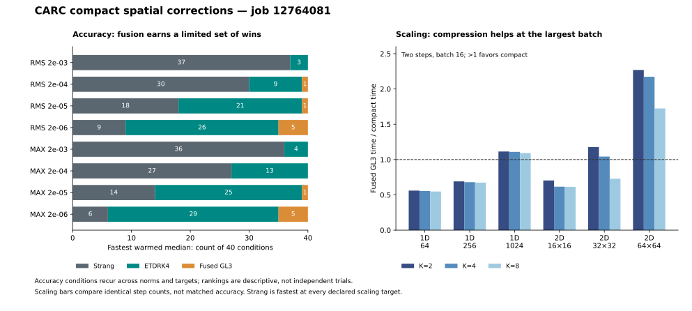

# CARC compact spatial review: retain fusion, reconsider input truncation

Job **12764081** supports fused GL3 as a faster implementation of the existing
correction. Fixed input-mode compression does not become the fastest complete
solver at any declared accuracy target. Its cost advantage appears at larger
batches, where this experiment's Strang baseline already meets every target.
The next mathematical question is whether inexpensive spatial features can
retain nonlinear interactions **before** discarding input frequencies.

This is a review of uploaded CARC CPU measurements, not a new numerical run.
The [machine-readable review](../results/carc-compact-spatial-review.json)
retains source hashes, verification evidence, paired summaries and figure data.
The original experiment, reference decisions and artifacts are unchanged.

## Verified CARC evidence

- **281 tests passed**, with no failures or skips, on CPU job **12764081**.
- All **2,760 candidates** completed with finite, admissible trajectories.
  The 4,640 method/norm/target entries comprise **4,593 feasible** and **47
  with no feasible tested step count**.
- All **166 individual references** in 58 case groups were accepted;
  **392 required parity checks passed**, and 232 approximation diagnostics were
  retained as observations. Numerical execution took **314.487 seconds**;
  recorded application time was **337.109 seconds**.
- Completion seals, configuration, plans and execution fingerprints match
  committed source **`5b6315c`**. The remote dirty flag remains recorded;
  matching execution files do not establish a globally clean remote checkout.
- Every exported scientific cell and provenance pointer verifies: **300,126
  CSV cells** and **31,126 JSON pointers**. Unmodified native Tower validates
  25 output contracts; 68 schema checks pass. The three excluded directories
  are the expected pytest cache/work and Tower report directory.
- All 47 original inventory entries, including the uploaded archive, remain
  byte-identical. No independent scheduler-accounting or actual CPU/RSS export
  was supplied; allocation resources are recorded requests.

The previously excluded `review/fresh/1d/05` reproduces its old third-attempt
RMS uncertainty, `1.144877e-10`, then passes the newly permitted fourth attempt
at `7.061435e-12`. The precision criterion was not relaxed and the earlier
exclusion remains valid for that earlier run. References solve the same
spatially discrete system; refinement uncertainties are estimates, not rigorous
certificates or continuum-error measurements.

## Fastest complete solver at matched targets

Counts below reuse each condition across two norms and four tolerances. They
are descriptive rankings, not independent trials. Warmed and setup-inclusive
frontiers were recomputed independently from the raw candidates.

| Cohort | Comparisons | Warmed: Strang | Warmed: ETDRK4 | Warmed: fused GL3 | Setup: Strang | Setup: ETDRK4 | Setup: fused GL3 |
| --- | ---: | ---: | ---: | ---: | ---: | ---: | ---: |
| All 40 accuracy conditions | 320 | 177 | 130 | 13 | 239 | 61 | 20 |
| Retained 24 conditions | 192 | 105 | 77 | 10 | 141 | 35 | 16 |
| New 16 stress conditions | 128 | 72 | 53 | 3 | 98 | 26 | 4 |
| 18 scaling groups | 144 | 144 | 0 | 0 | 144 | 0 | 0 |

All other methods have zero global wins. The retained/new rows partition the
accuracy row; the scaling panel has different workloads and is kept separate.
Strang leads at loose targets, while ETDRK4 leads most strict accuracy targets.

## Fusion succeeds, with one scaling reversal

At identical step counts, original GL3 divided by fused GL3 runtime has a
median ratio of **1.587x** across the 240 accuracy schedules. Fused is faster
in all 240; observed five-sample ranges are disjoint in 239. It preserves the
correction: the largest FP64 fused/full rollout difference is approximately
`3.00e-15`.

Fusion has 13 warmed global wins, including three on the new stress bank.
One rank is effectively tied: retained `2d/04`, RMS target `2e-5`, is
**0.802135 versus 0.802397 ms**, a **0.0327%** difference with overlapping
observed ranges. Twelve other warmed winners have disjoint ranges. Two of the
20 setup-inclusive wins also overlap; setup was measured once, so preparation
variance is unknown. Observed ranges are not confidence intervals.

Across the 36 scaling schedules the paired median speedup is **1.476x**,
with fused faster in 34. At **64x64, batch 16**, it is slower than original
GL3 by **8.0% at two steps** and **9.65% at eight steps**. This reversal is
measured; a memory/cache cause has not been measured.

Fusion reduces complete-step FFT calls from 18 to seven, but transformed fields
per member only fall from 18 to 17. Dispatch reduction is not a proportional
reduction in transform work. Keep both implementations in scaling controls.

## Fixed input cutoffs lose accuracy and small-grid cost

Against fused GL3, every compact method is slower in every jointly feasible
accuracy comparison:

| Compact method | Jointly feasible losses | Median compact/fused warmed cost | Unattained targets |
| --- | ---: | ---: | ---: |
| K=2, with mean | 314/314 | 1.893x | 6 |
| K=4, with mean | 316/316 | 1.890x | 4 |
| K=8, with mean | 316/316 | 1.888x | 4 |
| K=4, spatial only | 307/307 | 2.143x | 13 |

Fused GL3 attains all 320 accuracy targets. Strang misses 14 and the spectral
mean-only method misses six; these and the compact failures account for the
47 unattained entries. All are retained.

The stress bank explains a major representation weakness. Inputs containing
modes **9 and 10** have quadratic interactions at difference mode **1**.
Every tested input cutoff drops both source modes. Restoring the full-spectrum
GL3 mean repairs mode zero, not mode one. At the declared `h=T/4` diagnostic,
K=4 and K=8 raw corrections differ from full GL3 by **60.48% in 1D** and
**61.33% in 2D** in relative RMS on these cases.

The corresponding PDE errors are consequential. At one step and amplitude
0.04, the new 1D cutoff-pair case has RMS error **`3.978e-7` for fused GL3**
versus **`8.233e-6` for K=8**, about **20.7x** higher. The low-amplitude 1D
near-Nyquist case is approximately **156x** worse with K=8. These ratios compare
the same schedule; they are distinct from the matched-target cost table.

K=4 is less accurate than fused GL3 in all 96 new-bank RMS schedule comparisons,
with median paired error ratio **44.35x**; the median is **1.075x** on the 144
retained comparisons. The new diagnostics expose weaknesses that the reused
bank largely hides. Those are unfiltered descriptive ratios. Requiring both
errors to exceed ten times reference uncertainty gives medians of **36.33x**
over 84 new comparisons and **1.045x** over 130 retained comparisons; this
screen does not change the frozen feasibility decisions.
Even the declared smooth pattern contains mode five,
which K=4 drops. K=8 reproduces the initial smooth raw defect nearly exactly,
but subsequent nonlinear evolution can generate modes beyond its cutoff.

The mean/spatial combination is useful without being an accuracy guarantee.
Adding the raw GL3 mean to K=4 improves both RMS and maximum error in all 240
accuracy schedules. In scaling it slightly worsens RMS in six schedules
(at most about 0.19%) and worsens maximum error in 24/36 (up to about 15.21%).
The raw quadratic mean is not the exact nonlinear solution mean.

Compression is not the only accuracy limitation. Across eight new amplitude
pairs, full GL3's one-step empirical log–log slopes are approximately
**2.95–3.10**, versus **1.98–2.05** for K=4. These two-point diagnostics support
loss of useful quadratic correction under truncation, not universal error
laws. On 16-to-32-step comparisons with both errors above ten times reference
uncertainty, apparent-order medians
are **1.93 for full GL3** (28 conditions) and **4.00 for ETDRK4** (15).
ETDRK4 also remains more accurate than fused GL3 in all 18 same-step
comparisons on the three historical 2D controls, under both norms.

## Compression has a cost crossover, but scaling targets were too easy

At **64x64, batch 16, two steps**, warmed complete-batch times are:

| Method | Milliseconds |
| --- | ---: |
| Strang | 3.688 |
| K=2, with mean | 9.386 |
| K=4, with mean | 9.801 |
| ETDRK4 | 10.643 |
| K=8, with mean | 12.354 |
| Original GL3 | 19.725 |
| Fused GL3 | 21.300 |

K=4 is **2.173x faster than fused GL3** at the same schedule. It transforms
653,760 cells over the batch/rollout versus 2,228,224 for fused GL3. This is a
useful implementation crossover, but Strang remains faster and sufficiently
accurate at all declared targets.

In fact, two-step Strang already has worst-member uncertainty-adjusted maximum
error at most **`2.588e-7`** across the entire scaling panel, below its strictest
target of **`2e-6`** by a factor of about **7.7**. The scaling bank uses a smooth
spectrum and short horizon. Its timings test throughput for those workloads;
they do not establish who wins a demanding larger-grid accuracy problem.

## Recommended next direction

1. **Retain fused GL3 as a numerical control.** It delivers a reproducible
   implementation improvement on the accuracy bank. Test bounded quadrature
   or batch chunking around the largest-group reversal before assuming fusion
   helps every workload. Keep original GL3, Strang and prepared ETDRK4.
2. **Test nonlinear mixing before compression.** A low output frequency can
   depend on high input frequencies. Preserve phase-aware quadratic spatial
   interactions or local nonlinear features before selecting a compact output
   representation. Static low-input truncation should remain an ablation,
   rather than the main architecture on this evidence.
3. **Make the next scaling bank discriminate accuracy.** In a separately
   declared bounded protocol, include reference-resolved tighter targets,
   stronger coupling or longer horizons, and broadband/high-high interactions
   on larger grids. Freeze these choices before execution; do not rewrite
   this run's targets or promote a cutoff from diagnostic results.

The mathematical distinction in item 2 can be made explicit. Let
`v=u-mean(u)`, use normalized Fourier coefficients `v_hat=FFT(v)/N` with `N`
the total number of grid cells, and let
`lambda_k` be the eigenvalue of the original discrete diffusion operator,
including diffusivity. For `E_s=exp(s L)`, the quadratic interaction integrand
is `(E_s v)^2 - E_s(v^2)`. Its output coefficient is

\[
Q_m(s)=\sum_k\widehat v_k\widehat v_{m-k}
\left[e^{(\lambda_k+\lambda_{m-k})s}-e^{\lambda_m s}\right],
\]

with indices interpreted cyclically on the original grid in every dimension.
Selecting output modes **after** this full-input interaction preserves the
high-frequency sources of those outputs. It is not the whole GL3 correction:
reaction Jacobians, transport, quadrature weights and endpoint subtraction
still apply. It also does not recover discarded outputs or missing
finite-amplitude terms, and direct evaluation need not be inexpensive.
Any approximation must earn its place in complete-rollout timing.

These findings identify an architectural constraint, not an advantage over
FNO. No neural training, larger campaign or new PDE solves were performed
during this review.
