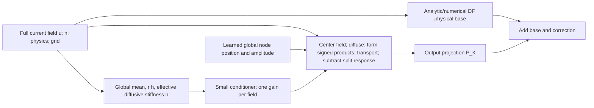

# TDN: a bounded research portfolio

Protocol design date: **2026-10-08, America/Los_Angeles**. This document defines the next research program. Historical measurements below are retained evidence, not results of the new program. The authoritative executable settings are in `tdn/analysis/portfolio/protocol.py`; a run's sealed copy, source hash and actual resource ledger take precedence over estimates in this document. See [the hypothesis register](PORTFOLIO_HYPOTHESES.json) for explicit controls, predictions and retirement rules.

**Diagnosis.** The clearest finding is that preserving signed nonlinear interactions before output compression matters on high-frequency interaction workloads. The leading 43-parameter model exploits this representation, but its learned advantage remains confounded by a half-normalized frozen control, unmatched analytic quadrature and limited neural-baseline optimization. Its complete solver cost has not beaten the strongest measured classical alternatives. The next campaign therefore runs three protected paths: **A, attribution and fairness; B, justified improvements; C, different representations and workloads.** A negative learned result can still yield a useful numerical formula or a clear representation result.

The intended contribution is a conditional statement: *which physical structure, representation and temporal computation improves which accuracy–cost or generalization objective, against which credible control?* It is not a universal ranking or an obligation to retain a neural network.

## Verified starting evidence

The consequential implementation checks are `frontier/models.py::PhaseRankOne`, `roadmap/numerics.py::quadratic_df_defect`, `frontier/numerics.py`, `frontier/data.py`, and the matched comparisons in `results/frontier-full-review/learning-review.json` and `gates-review.json`. The [machine-readable evidence map](../results/portfolio-development/evidence-map.json) records source paths, hashes, selections and limitations. Historical confirmation has already been inspected and is now **development evidence** for this program.

| Evidence class | Observation verified against code or retained measurements | Consequence |
|---|---|---|
| Established within the experiment | Frontier rank1 has 43 stored/trainable real parameters: one node parameter, one amplitude and a 3→8→1 conditioner. The full state enters its physical branch. | Parameter count describes learning capacity, not total inference work. |
| Established within the experiment | With 32 training fields, rank1 passes 668/720 repeated primary-schedule observations in each track; local small/standard FNO pass 313/720 and 337/720 in the discrete track. There are **24 independent fields**, not 720. | Bounded accuracy evidence against these implementations; no published-FNO claim. |
| Mechanistically plausible | Input compression loses the interactions needed by retained output modes. Rank1's largest improvements over its input-compressed ablation are on high-pair, rough and near-Nyquist fields. | Retain interaction preservation and an exact placement ablation. Only three independent fields per historical regime limit inference. |
| Confounded | Frozen historical weights are 0.25+0.25; normalized Gauss-2 uses 0.5+0.5. Historical analytic quadratic uses four nodes and no output cutoff. | A learning gain over the historical control does not isolate state conditioning, normalization or node placement. |
| Confounded | Classical endpoint menus include extra 1/2/4/8-step endpoints absent from neural menus. | Current policy-cell classical advantage is real for the declared menus; the complete equal-menu neural frontier remains unmeasured. |
| Negative | Analytic quadratic has about 2.81× lower discrete paired RMS than rank1 and is only about 7% slower on identical primary schedules. | Match its node count and support before crediting learning. |
| Negative | Observed strongest-classical policy-cell frontier is about 8.28×/6.84× faster than rank1 in discrete/continuum tracks. Rank1 loses every small-FNO scaling comparison. | Deployment optimization has no established margin; defer policy stacks. |
| Negative | Higher rank and many C1/C2 combinations increased work without enough benefit; mean replacement could damage a strong analytic component. | Test a combination against its strongest contained component, including mean and centered errors. |
| Implementation/measurement defect | Earlier roadmap endpoint comparisons mixed physical horizons; corrected tables are available. Historical cold first calls distorted one fallback-only amortization result. | Preserve originals, use corrected same-horizon analyses, interleave timing and separate cold/warm costs. |
| Implementation/measurement risk | All recorded frontier FNO updates clipped at norm 1, with much larger unclipped norms than rank1. This is a symptom, not proof that clipping caused poor performance. | Inspect scaling, loss and optimization before a competitive-neural claim. |
| Untested opportunity | Normalized same-node controls, non-neural fitted gains, equal endpoint menus, reusable interaction encodings, coarse-state ambiguity and precomputation work selection. | These become explicit question-bearing experiments, with budget and stop rules. |

The historical five-gate outcomes remain **G1 GOOD, G2 BAD, G3 BAD, G4 BAD, G5 NA**. A 95/100 check-attainment score alongside a BAD gate is not “95% successful science.” Report software completion, mathematical checks and scientific outcome separately.

## What the current architecture is

The starting PDE is periodic scalar logistic reaction–diffusion,

\[
\partial_t u=L u+r u(1-u),\qquad L=\kappa\Delta.
\]

On the **discrete track**, the specified equation uses the periodic central-difference Laplacian and nodal multiplication. On the **continuum track**, the evaluated model uses spectral diffusion and a dealiased Galerkin quadratic reaction on its own grid; references additionally refine the grid. A finite Galerkin solution is not itself continuum truth. Exact sampled logistic reaction is valid for the nodal equation, but not for the projected Galerkin reaction, which is advanced numerically.

The model computes

\[
u_{n+1}=S_h^{DF}(u_n)+P_K Q_\theta(u_n,h),
\quad
S_h^{DF}=H_{h/2}R_hH_{h/2},
\quad H_s=e^{sL}.
\]

`DF` is the established diffusion-first Strang orientation. `P_K` projects the correction outputs after nonlinear products; the physical base always receives the full state. No hidden recurrent state, attention layer or memory is used. Rollout repeatedly applies this one-step map. It is temporal in that it evaluates a requested step, but it is no longer the original horizon-independent encoder with learned exponential decoder.

The original three conditioner features are the mean, `log1p(r h)` and `log1p(h γ)`, where

\[
\gamma=-\langle v,Lv\rangle/\langle v,v\rangle,\qquad v=u-\bar u.
\]

The conditioner does not see pointwise morphology or interaction phases. The physical branch does. Fourier transforms, transport, products, projections and memory traffic dominate its possible cost; the tiny MLP does not eliminate that work. The node pair is symmetric about half time. “Rank one” denotes one symmetric physical pair, not matrix/Tucker rank.

Exact correction nulls for constants, zero reaction, zero diffusion and zero time are useful algebraic requirements. They do not prove positivity, monotonicity, finite-step stability, fourth-order temporal convergence or a useful solver.

## Mathematical target and error diagnosis

Write a perturbed field as \(u_0=c+\epsilon v\) with zero-mean \(v\). Let \(c(t)=R_t(c)\) be the homogeneous logistic solution and \(q(t)=\partial_cR_t(c)\). Variation of constants gives

\[
u(t)=c(t)+\epsilon q(t)H_t v+\epsilon^2 z_2(t)+O(\epsilon^3),
\]

\[
z_2(h)=-r q(h)\int_0^h q(s)H_{h-s}\big[(H_s v)^2\big]\,ds.
\]

For Galerkin dynamics, every product in this formula is the appropriate projected/dealiased product. Subtracting the quadratic coefficient of the DF split produces

\[
Q_2(h)=-r q(h)\int_0^h q(s)
\left\{H_{h-s}[(H_s v)^2]
-H_{h/2}[(H_{h/2}v)^2]\right\}\,ds.
\]

This is the implemented `quadratic_df_defect` convention: quadratic means amplitude order, not global time order. Finite quadrature approximates the integral. Midpoint-only quadrature returns zero because the bracket is identically zero there. Normalized Gauss-2 is an inexpensive defensible starting rule; quadrature exactness alone does not remove cubic/higher-amplitude defects. The complete method generally remains second order in time unless additional order conditions are demonstrated.

For a Fourier interaction \(p+q=k\), define \(d_{pqk}=\lambda_p+\lambda_q-\lambda_k\). The corresponding coefficient is

\[
-r q(h)e^{h\lambda_k}\hat v_p\hat v_q
\int_0^h q(s)\left[e^{s d_{pqk}}-e^{h d_{pqk}/2}\right]ds.
\]

The input phases and pair-dependent rate matter; output frequency alone generally cannot determine this response. On a nodal discrete grid, the convolution includes the equation's wrapped indices. On the Galerkin track, retained nonaliased pairs are the intended operation. Treating those conventions as interchangeable would learn the wrong equation.

This formula creates three possible contributions: preserve informative products; approximate their time kernel more cheaply; learn a residual that quadrature alone does not resolve. Those are different hypotheses.

### Attribution of error is an intervention, not a pie chart

Norms of error components do not add: cancellation may make a combination better or worse than either part. Record signed field differences before norms wherever practical. A useful telescope is

\[
\hat u-u_{\rm continuum}
=(\hat u-u_{\rm specified\ discrete})
+(u_{\rm specified\ discrete}-P_Nu_{\rm continuum})
+(P_Nu_{\rm continuum}-u_{\rm continuum}),
\]

with an explicit common comparison space. The first term contains integration, representation and implementation error; the second is discrete-equation bias; the third is unresolved output information. An approximate teacher adds its own uncertainty. Learning term two is **continuum-bias compensation**, not evidence that the discrete time integrator is more accurate.

| Potential bottleneck | Cheap controlled diagnostic | What would change the next experiment |
|---|---|---|
| Spatial discretization | Paired continuous fields on N, 2N, 4N with independently refined time; compare FD/nodal and Galerkin targets separately | If spatial error dominates, changing temporal gain is not a continuum solution; refine or formulate a separate closure target. |
| Time integration | Step-halving on fixed equation/grid with a tighter independent teacher | Require a resolved slope; flat curves may reflect spatial or roundoff floors. |
| Interaction/quadrature | Two/four/eight normalized nodes with equal support, amplitude sweeps and exact spectral-pair tests | If node refinement changes little, stop buying more quadrature. If cubic residual dominates, a richer scalar conditioner is unlikely to fix its shape. |
| Compression | Full/full, full/output-cutoff and input-cutoff/output-cutoff with identical physical core and nodes | Quantify retained-mode and discarded-mode error separately; do not filter the base to make an ablation fail. |
| Optimization | Initialization/selected/final loss; gradient/clipping frequency; parameter motion; repeated seeds; tiny-set overfit check | Distinguish inability to fit from inability to generalize. More data is not the remedy for an optimization failure. |
| Reference uncertainty | Actual time refinement, spatial refinement and an independently implemented small-grid cross-check where feasible | Unresolved references give NA scientific accuracy, not failure of a candidate or a training label. |
| Implementation | Frozen methods; end-to-end timing plus separately timed transforms, features, transport, products and allocation/cache behavior | Optimize a measured bottleneck; recheck numerical parity and provide comparable caching to competitors. |
| Verification/deployment | Estimator, rejection, fallback, setup and tail costs | Do not develop policy learning while the underlying accurate method has no plausible margin. |

The discrete analytic identity \(\overline{u}'=r[\bar u(1-\bar u)-\operatorname{Var}(u)]\) motivates diagnostics, not exact future mean closure. Mean and centered error obey \(\mathrm{RMS}(e)^2=\bar e^2+\mathrm{RMS}(e-\bar e)^2\). Preserve both so a bad mean head cannot hide behind a good spatial correction.

## Claims and predeclared success criteria

These are claim-specific decision criteria; exploratory observations remain useful even if they fail. All comparisons use the same equation, final time, error definitions and accepted reference. The frozen thresholds are 1.5× for the pure representation diagnostic, 1.1× for learned error improvement and 1.2× for practical speed. These are practical effect thresholds, not proofs or p-values. The declared joint-target coverage tolerance is at most five percentage points regression, with at least 95% feasibility for a practical solver claim; always show the actual regression, rather than calling a tolerated loss “no harm.” Bootstrap whole independent fields, carrying every paired grid/schedule/seed with its field. Do not use endpoint rows as independent samples. Confidence intervals and observed learning ranges are different objects.

| Claim | Primary comparison and quantitative criterion | What is insufficient |
|---|---|---|
| Better nonlinear representation | Full-input versus input-compressed matched correction: ≥1.5× field-cluster geometric RMS reduction in the declared matched representation comparison, 95% interval lower bound >1; report joint-target failures and easy-case regressions separately | Oracle fit alone; pooling stress gains with easy workloads; post-hoc regime selection |
| Useful learning beyond analytic mathematics | Full conditioner versus strongest validation-selected normalized same-node/support fitted or frozen rule: ≥1.1× field-cluster geometric RMS reduction, 95% interval lower bound >1, at most the declared five-percentage-point joint-coverage regression; report complete cost and mean/max-error harm | Beating half-normalized initialization; beating a weaker contained component |
| Neural accuracy/data efficiency | Credible FNO controls under equal data and measured training-compute analyses; fixed-target pass/error improvement with intervals and all optimization failures retained | Equal parameter/update counts; an unusable direct FNO; claiming sample complexity from two tiny subsets |
| Generalization | Freeze before fresh state/parameter/grid/horizon shifts; report each shift's paired error, joint pass and failure frequency; improvement must survive the declared shift without worse failure coverage | Changing the field and calling it pure grid transfer; using a previously inspected cohort |
| Lower complete solver cost | ≥1.2× accuracy-qualified speed ratio versus strongest eligible validation-selected control, field-cluster interval lower bound >1; at least 95% feasibility and at most five-percentage-point coverage regression; setup, rejection/fallback and offline amortization included | Same-schedule latency; best-case speed only; reference-informed selection described as a deployment policy |
| Useful numerical method | Normalized/derived/distilled rule satisfies stated consistency/null/order checks and offers a reproducible accuracy–work advantage or clearly characterized regime benefit over its strongest component | A small network alone; mathematical nulls called stability; “new to TDN” called literature novelty |

The full confirmation cohort has 24 fresh independent fields. Regime-specific subgroups are therefore small; their intervals and negative results must be shown. This campaign cannot establish rare-event safety, universal superiority or a broad convergence theorem. If an analysis changes after confirmation is inspected, label it exploratory and reserve a new cohort for the revised claim.

## Path A: decisive attribution and credible comparisons

The main matrix is deliberately structured rather than Cartesian:

| Family | Learned part / role | Question |
|---|---|---|
| `historical_half` | None; original half-normalized Gauss pair | Preserve the historical point of comparison without treating it as a strong analytic baseline. |
| `quad2_fixed` | None; normalized Gauss-2, output cutoff | What does normalization alone accomplish? |
| `quad2_amplitude` | One fitted global amplitude, bounded to (0.25, 1.75) | Does a scalar rescaling explain the useful learning? |
| `quad2_nodes` | Symmetric node position | Does node placement help without amplitude freedom? |
| `quad2_joint` | Node and amplitude | Is joint scalar fitting enough? |
| `quad2_linear` | Four-coefficient affine feature response with a bounded tanh link | Does non-neural low-dimensional regression explain state dependence? |
| `quad2_conditioned` | Full compact conditioner | Is nonlinear state conditioning necessary beyond those controls? |
| `quad2_input` | Input-compression ablation | Does the missing information matter with normalization repaired? |
| `quad2_full`, `quad2_conditioned_full` | Frozen/conditioned pair without output cutoff | How much error or apparent benefit comes from filtering? |
| `quad4_fixed`, `quad4_full`, `quad4_conditioned` | Four-node normalized/conditioned variants | Is added quadrature, support or learning responsible? |
| `analytic_quad_cubic` | Untrained strongest higher-amplitude control | Does the gain survive a strong analytic alternative? |
| `df`, `rf`, `etdrk4` | Established numerical backbones | Does an established method already solve the workload more cheaply? |
| `fno_small`, `fno_standard`, `direct_fno` | Local neural-operator controls | Does the result survive useful capacities and both physics-assisted and direct prediction? |

The trained records are separate from architecture families. All applicable families receive the **same endpoint step menu**, including one/two/four/eight steps. Equal-menu endpoints and any additional nonuniform/intermediate-output schedules remain separately labeled; an endpoint-only method is not credited with unmeasured dense outputs.

Use two interpretations: (1) controlled matched node/support/operator settings for attribution; (2) a validation-selected accuracy–cost envelope for practical comparison. A confirmation-truth-informed envelope is reported as a retrospective work–precision diagnostic, never as a frozen deployment choice.

The fitted non-neural controls now use the same admissible effective gain interval (0.25, 1.75) and the same field-scaled mean-square plus 0.1×maximum-square training objective as the neural model. Least squares supplies an initializer: a bounded one-dimensional optimizer refines the amplitude, while a deterministic L-BFGS-B fit refines the four-coefficient affine predictor with a tanh link. The latter is a simple generalized linear response, not an unconstrained linear gain or a hidden MLP. Ridge regularization applies to initialization only; optimizer success, iteration counts, objective evaluations and costs are recorded. It is entirely plausible that these stronger fitted controls explain the useful conditioner behavior, which would favor a simpler numerical rule. Different optimization procedures still have different convergence limits, so optimization adequacy remains part of the evidence.

Identifiability is an explicit question. In the historical model, global amplitude and the conditioner's approximately constant gain multiply each other, so different parameter vectors can implement nearly the same response. Compare the **effective gain and correction fields** on a fixed development probe bank, not only raw weights. Node/amplitude sensitivity, near-collinearity of response Jacobians and amplitude-only fit quality can reveal redundancy. A preferred parameterization is one that preserves identifiable normalized shape and makes any learned residual explicit.

### FNO audit and fairness

The official `neuraloperator` source was inspected as prior art. It includes a local skip path and channel mixing/nonlinearity in addition to spectral truncation. Our local FNO likewise retains its full-grid local path. It would be incorrect to attribute every high-mode weakness to “FNO discards all high frequencies.” Current official defaults differ from the project's adapted architecture; this source audit is **not** an official benchmark reproduction.

The minimum credible local audit records physical inputs, feature scaling, spectral support convention, initialization, trainable gradient coverage, update count, optimizer settings, gradient norms/clipping, selected checkpoint, elapsed training/tuning time and held-out validation curves. Direct FNO predicts much more than a physical residual and may need different output/loss scaling. Diagnose this explicitly; do not remove its failures or assert competitiveness because gradients are nonzero.

Schedule selection currently measures validation fields in matching-physics batches, while fresh confirmation also measures individual fields. A frozen choice transfers honestly, but the batch-to-single-field cost change can alter the fastest schedule; call this a transferred validation-selected choice, not the proven optimum for every deployment batch.

Equal-data trials use identical training fields. Equal-training-compute analyses use actual measured training time and exposure, not equal updates. Equal-inference-cost comparisons use measured complete inference on the same workload. The best validation-selected frontier allows differing capacities and schedules while charging tuning and selection. These are complementary analyses and must not be conflated. Official-library reproduction is a promotion requirement for any paper-level FNO claim and remains outside this first bounded local campaign.

## Path B: evidence-grounded improvements

Three implemented model extensions are bounded pilots: `conditioned_rich`, `residual_quad2` and `band_gain`. Their definitions and actual parameter counts must be taken from architecture metadata, not inferred from their names.

| Hypothesis | Mechanism and expected consequence | Falsifiable prediction / stop rule |
|---|---|---|
| B1, richer global conditioning | Add cheap amplitude/variance, gradient or band-energy information omitted by the three original features. Useful only if equal old features can require different corrections. Charge feature extraction. | Validation response ambiguity and RMS improve beyond `quad2_linear`/`quad2_conditioned`; stop if gains are within uncertainty or feature overhead dominates. |
| B2, analytic-anchored residual | Start at normalized analytic quadrature and learn an explicitly bounded correction to it. This separates the useful formula from learned departure. | Better generalization/optimization without harming easy exact limits; compare against the normalized anchor and unconstrained conditioner. Stop if learned departure reproduces a constant scalar or damages maximum error. |
| B3, band-dependent adaptation | Let retained output bands receive distinct gains, while forming nonlinear products before projection. Extra spectral reductions or filters are charged. | Helps regimes where scalar gain cannot fix differently signed/band-local defects. Stop if no gain over the strongest scalar component or new filtering causes mean/rollout damage. |
| B4, compute investigation | Profile frozen methods; share transforms, cache only valid state-independent coefficients, batch/vectorize or compile when parity holds. | End-to-end improvement after warmup with matched accuracy and competitor optimizations; stop a transformation if its costs outweigh savings. |
| B5, learning/data | Track-correct residual targets, meaningful scaling across regimes, separate endpoint/max/mean/spectral/rollout diagnostics; development-only sampling. | Better held-out behavior at declared measured compute, rather than merely lower normalized training loss. |

The broader requested options are retained in the register below. They are **not** silently declared implemented experiments:

| Direction | First-stage disposition | Cheapest deciding experiment |
|---|---|---|
| Variance/stiffness/interaction features | Implement rich-global pilot | Construct states sharing old features but requiring different optimal gains. |
| Spatially varying conditioner | Defer until scalar/band misspecification is observed | Project teacher defect onto scalar, band and pointwise response spans on development fields; oracle projection is a capacity diagnostic only. |
| Normalized weights / learned nodes | Implement attribution controls | Normalization, node/amplitude ablations and quadrature moment checks. |
| Higher-order/selective cubic work | Keep analytic quadratic+cubic; selection prototype | Predict from cheap initial features when cubic correction is worth its full cost; compare fixed quadratic/cubic and deterministic threshold. |
| Alternative low-rank or multiband representation | Band pilot and X01 | Compare response approximation error against storage/transform counts. |
| Exponential/rational time bases, continuous kernels | X01 tests a reusable kernel/temporal approximation | Same-state many-horizon error and cost; reject if interpolation or encoding dominates. |
| Dense output / variable steps | Equal shared schedules; X01 repeated queries | Compare against cached classical solutions/dense interpolation at every requested time. |
| Alternative physical decomposition | DF/RF/ETDRK4 controls now; learned decomposition deferred | Frozen-backbone residual magnitude and cost; no credit to learning for a better split. |
| Composite architectures | Defer automatic cross-products | Add one useful component to the strongest validated contained component, retain ablation and test error cancellation. |
| Curriculum, adaptive sampling, rollout loss | Keep explicit development extensions; no adaptive confirmation | Small fixed-budget pilot with field-disjoint validation and mean/max/rollout harm checks. |
| Mixed precision, fusion, compilation | Profile first; FP32/TF32-off scientific default | Numerical parity or recorded accuracy tradeoff against eager FP32; full compilation/cache setup charged. |
| Deployment policy | Block unless a cost margin exists | Deterministic validation-selected schedule first; learned selection must beat it including rejected work. |

## Path C: protected high-risk prototypes

The [exploration implementation note](PORTFOLIO_EXPLORATION.md) provides exact prototype equations and artifacts. These are deliberately different from merely increasing network width. They can return a useful impossibility result or a negative cost result. “New to this project” is the present claim; literature novelty is unestablished.

### X01 — reusable interaction representation and time kernel

**Challenged assumption:** every new horizon must repeat every physical transport/product. Encode same-state signed Fourier pairs once, and approximate/evaluate their time-response kernel across horizons using a compact temporal representation. The full logistic-background, zero-subtracted kernel derived above is the eventual target. The implemented first prototype deliberately studies a simpler one-dimensional constant-generator **second-Picard quadratic response**, with kernel K(h;a,b)=∫₀ʰ exp((h−s)a+sb) ds. It compares a closed-form kernel, Gauss rules, FFT quadrature, cached pair products, degree-12 Chebyshev encoding and classical DOP853 dense output on exactly that response task. Fitting K(h)/h preserves the zero-time limit. This is neither the full nonlinear PDE solution nor the complete DF correction; a successful response representation must later transfer to them. The Chebyshev surrogate is an approximation control, not a trained neural operator.

**Payoff:** many times from the same state could share expensive products and transforms. If encoding costs \(E\), each query costs \(q\), and a comparable direct query costs \(d\), the break-even count is \(Q>E/(d-q)\), provided \(d>q\). Report NA when no positive margin exists. Memory and output reconstruction are charged.

**Risk:** direct pair enumeration is quadratic in mode count; kernels may require many terms over stiff parameter ranges; a cached state representation becomes invalid after a rollout state changes. Changing reaction or diffusion parameters can invalidate time coefficients even if geometric pair products remain reusable. Reuse must be keyed by state, grid, operator, parameters and precision as applicable.

**Cheap rejection experiment:** paired same-state horizon queries, fixed accuracy target, query counts and spectral support sizes; compare exact direct quadrature, cached numerical evaluation, temporal approximation, and a classical solution with reusable intermediate outputs. Compare kernel/correction parity separately from full PDE error. A cheap surrogate of an inaccurate correction is not a useful solver.

**Advance:** exact-representation parity within 1e-10, temporal approximation relative RMSE at most 1e-3, and a reproducible accuracy-qualified break-even count no greater than 32 queries, without unjustified reuse during state-changing rollout. Then replace expensive exact pair encoding with structured low-rank/exponential/rational approximations and test parameter transfer. That expansion needs a newly frozen protocol.

### X02 — coarse-state ambiguity before learning a closure

**Challenged assumption:** the current coarse field alone contains enough information to predict its future. Construct two resolved fine fields with the same retained coarse state but different unresolved high-frequency pairs. Their retained nonlinear derivative can differ:

\[
P_Ku=P_K\tilde u\quad\text{but}\quad P_K(u^2)\ne P_K(\tilde u^2).
\]

An instantaneous deterministic function of \(P_Ku\) cannot give both correct derivatives. This is an information argument, not a training failure.

**Payoff:** a compact closure could avoid repeatedly evolving fine degrees of freedom. A useful new state might include signed interaction moments, unresolved spectral energy or a small memory variable rather than the full fine field.

**Risk:** unresolved energy alone loses phases; memories can become unstable or require information unavailable in deployment. A pair of counterexamples proves insufficiency on that pair, not universal necessity of every proposed memory architecture.

**Cheap rejection experiment:** the implemented one-dimensional finite Galerkin study constructs sign/phase twins with identical retained modes and energy, predicts their first complex low-mode coefficient at a short future horizon, and compares an instantaneous mean/variance fit, history persistence, a fitted history rule and a labeled full-state instantaneous oracle. A short backward-generated history supplies the prototype memory feature; its generation time is charged. This engineered history is not evidence that histories will be readily available or stable in a deployed coarse solver. Adaptive DOP853 references are cross-checked against refined RK4 on a declared subset, not certified for every continuum field. If the proposed added statistic still collides, reject that state representation before training a larger network.

**Advance:** retained twin-state mismatch at most 1e-12 with unresolved response separation above 1e-8, and an augmented/history representation reducing held-out response RMSE by at least half; then require sufficient added information on fresh twins and ordinary fields, bounded rollout errors, and a plausible reduction of fine work. Then compare a trained Markov closure, deterministic augmented closure and an explicitly history-dependent closure. Mori–Zwanzig is prior conceptual ground; memory alone is not a novelty claim.

### X03 — decide work before doing it; distill if possible

**Challenged assumption:** every field must pay for every correction node/channel/order before deciding what mattered. Use initial spectral energy/stiffness/interaction summaries to choose an inexpensive interaction approximation or order. Charge the selector, selected computation and recovery/fallback.

**Payoff:** avoid transforms or products, rather than only shrinking a neural network that sits beside them. If a learned selector becomes a simple monotone threshold, replace it with a deterministic rule and remove inference learning.

**Risk:** energy proxies miss phase cancellation or high-high-to-low effects, and selection may cost more than the avoided work. A selector using the actual full correction or true error is an oracle and cannot count as deployable savings.

**Cheap rejection experiment:** compare a fixed full calculation, fixed cheap calculation, a deterministic initial-feature threshold, and a development-fitted compact selector on separate validation fields. The initial implementation selects conjugate mode pairs before their products, using smooth/sparse/rough synthetic fields and a separate fitted/held-out split. An additional equal-magnitude eight-phase audit probes cancellation failure; its correlated variants remain outside independent-field aggregates and have no post-hoc success threshold. It targets a second-Picard response, not an entire PDE solve. A posteriori correction-based selection remains a diagnostic upper bound with its full cost charged.

**Advance:** relative correction error at most 1% and at least 1.10× total speedup in the prototype, followed by full PDE accuracy/failure qualification and a positive end-to-end margin over the best simple heuristic, surviving held-out phases and parameters. Otherwise retain a negative finding or a distilled numerical rule; do not expand policy learning.

## Learning, statistical and execution protocol

Fresh field identities use separate smoke/development/full seed namespaces (51/52/53 million), disjoint splits and continuous field definitions shared across paired grids. Full training has three paired seeds and nested 8/32-field subsets. AdamW uses zero weight decay, batch four, learning rates 0.001/0.0003, 40 tuning updates and at most 200 final updates, validation every 25 updates, and a 120-second per-trial ceiling. FNO additionally compares norm-one clipping/default scale with unclipped gradients and loss scale 0.01; each optimizer/rate trial is charged, so this is not only two FNO tuning trials. Non-neural fits have at most 100 optimizer iterations and two ridge initializers (1e-8/1e-4) selected on validation. These remain bounded pilots, not evidence of convergence. Report examples seen, data size, elapsed tuning/training and initialization selection. A family that is still improving at its budget boundary is optimization-unresolved, not asymptotically inferior.

Reference preparation precedes training. Fresh confirmation preparation follows a **sealed freeze of all selected models/settings**. Reference refinement failure prevents supervised use and yields NA confirmation accuracy. No confirmation truth informs checkpoints, adaptation thresholds or new feature selection. Training on discrete teachers and evaluating continuum improvement are separate questions; a track label cannot repair mixed targets.

Cheap diagnostic truth can be used to estimate representation headroom, but oracle projection/fitting must be labeled and separated from deployable models. Endpoint, RMS, maximum, mean, centered, spectral and short-rollout diagnostics reveal different failure modes. Adaptive sample selection is restricted to development/training; validation remains independently held out and confirmation remains untouched until selection is frozen.

The discretionary numerical pilot budget is **7,200 seconds**: A **3,960 s (55%)**, B **1,800 s (25%)**, C **1,440 s (20%)**. A and B each have three bounded seed units; C has three independent 480-second prototype units. Shared teacher generation, fresh confirmation, required tests and reporting are separately costed prerequisites, not secretly charged to exploration. Percentages reserve ceilings, not mandatory waste; unused speculative budget does not silently become a larger training campaign.

All native jobs respect the Fedora node's 110000 MiB scheduler memory, maximum eight physical CPU cores, maximum 48 GiB requested host memory, GPU stages at four CPUs and one RTX 4090, and **45 minutes maximum allocation**. Science budgets leave time for validation and sealing. Dedicated VRAM remains 24 GB with the existing 18 GiB/75% soft and 90% hard policy; host RAM is not VRAM. CPU-heavy and GPU jobs are serialized as needed for this single node; there is no arbitrary pending-job cap. Tower exports belong to the project; Tower itself is unchanged.

Recoverable units seal source/protocol/software/cohort identities, journal completed trials or parent partitions, and retain interruptions and costs. Confirmation uses small whole-parent partitions with exact coverage verification. Aggregation must reject duplicates, missing partitions, mismatched targets and incompatible sources. Reporting runs after any outcome and shows absent/failed stages; successful reporting cannot make incomplete science complete.

Local CPU smoke/development and native GPU validation are distinct. This cloud environment can run bounded CPU checks and prototypes. It cannot establish RTX 4090 performance or execute the user's desktop Slurm allocations. The runbook provides native commands; each report records **implemented**, **locally verified**, **GPU verified**, and **scientifically confirmed** separately.

## Complete costs and analytical outputs

Measure cold first use, warm latency distribution, throughput, peak allocated/reserved GPU memory, host resource use, preprocessing, teacher generation, tuning/training, and all failed/interrupted allocations. Monetary cost remains NA unless a declared electricity/service rate is supplied. Do not translate GPU allocation time directly into model inference cost.

Randomize paired method timing order, synchronize the actual device, retain repeats and separate profiling from deployment timing. Cache keys must include every value that changes coefficients; state-dependent caches require an exact state identity or explicit lifecycle. Comparable optimization opportunities apply to DF, ETDRK4, analytic quadrature and FNO. A measured deployment campaign cost is

\[
C_{\rm total}=C_{\rm teachers}+C_{\rm tuning}+C_{\rm training}+C_{\rm preprocessing}
+\sum_i(C_{{\rm inference},i}+C_{{\rm estimate},i}+C_{{\rm reject},i}+C_{{\rm fallback},i}).
\]

Offline amortization requires positive per-query savings and a declared number/distribution of deployments. Cold and warm scenarios remain separate. Selection using true error is not a deployable policy.

The new atlas should expose model/information-flow metadata; controlled attribution; same-schedule and accuracy-qualified frontiers; loss/data/compute; generalization and failure coverage; spectral/spatial/mean and rollout error; runtime/memory; amortization; effective learned parameters; and all speculative outcomes. Every panel retains source rows and missing-data status. Dense learning plots use continuous translucent observed min/max bands with thin borders; these are **not confidence intervals**. Statistical field-cluster uncertainty is shown separately. Ours uses triangles, Theirs uses contrasting markers, analytic controls have their own role, and all axes explain which direction is favorable. Absent measurements stay absent rather than becoming interpolated evidence or zero.

## Prior-art audit and novelty boundary

The source audit retrieved the following authoritative repositories on the design date; source hashes and URLs are recorded in [the tracked retrieval manifest](../results/portfolio-development/prior-art-source-manifest.json). This is a targeted implementation/prior-art check, not a systematic literature review or reproduction of reported benchmark numbers.

| Primary source / implementation | What was checked | Implication for TDN |
|---|---|---|
| [Li et al., FNO, ICLR 2021](https://arxiv.org/abs/2010.08895); [official NeuralOperator](https://github.com/neuraloperator/neuraloperator), `neuralop/models/fno.py` and spectral layer | Spectral mixing, full-grid/local skip, channel MLP, nonlinearities, precision/support options; modern library README points to its 2025 practical guide [2512.01421](https://arxiv.org/abs/2512.01421) | A specialized hybrid should be compared fairly with an explicitly declared FNO version. The guide was identified, not independently reproduced. |
| [Lu et al., DeepONet, 2021](https://doi.org/10.1038/s42256-021-00302-5); [author repository](https://github.com/lululxvi/deeponet) | Branch/trunk operator-learning project and source attribution | Encoding a function once and querying coordinates/time is established operator-learning territory; reuse is not inherently novel. |
| [Cox–Matthews 2002](https://doi.org/10.1006/jcph.2002.6995), [Kassam–Trefethen 2005](https://doi.org/10.1137/S1064827502410633); [Exponax](https://github.com/Ceyron/exponax) | Periodic Fourier ETDRK1–4, exact linear propagation, dealiased/pseudospectral implementation references | Exponential propagation and hardware-efficient established solvers are serious controls. Repository speed claims are not TDN measurements. |
| [Diffrax](https://github.com/patrick-kidger/diffrax); [torchdiffeq](https://github.com/rtqichen/torchdiffeq) | Adaptive/explicit solvers and dense solutions/multiple requested times | X01 must compare with numerical reuse and dense output, not a deliberately repeated uncached solve. |
| [PDEArena](https://github.com/pdearena/pdearena), [Gupta–Brandstetter, 2022](https://arxiv.org/abs/2209.15616) | Multi-spatiotemporal-scale benchmark and maintained model/data organization | Generalization needs explicit temporal/spatial/parameter shifts and credible training, beyond a single-step local-control tournament. |
| [PySINDy](https://github.com/dynamicslab/pysindy); Brunton, Proctor and Kutz, 2016 | Sparse system identification and interpretable fitted dynamics | Distilling a learned response to a numerical rule is legitimate but not intrinsically new. |
| Mori–Zwanzig reduced dynamics; projection/memory framework | Mathematical background used for X02, not a newly reproduced paper implementation | An instantaneous coarse collision motivates added state/history; it does not establish a new memory theorem or a novel closure. |

No novelty claim is made for learned quadrature, learned closures, exponential time bases, neural operators or computational selection by themselves. A publishable contribution would require the specific representation/constraints/workload, a meaningful mathematical property or cost result, and a fuller related-work search after the winning mechanism is known. This stage should narrow that search rather than invent a novelty story in advance.

## Decision policy

Continue A regardless of whether B/C succeed: normalization, equal menus and credible controls are necessary to interpret the current result. Continue B only when it improves on its strongest contained analytic/fitted component. Preserve C's explicit capacity and publish negative prototypes; do not let them block attribution or grow without a measured premise.

At the first review, ask in order: **Is the reference resolved? Is the equation/measurement comparison correct? What component explains the gain? Does it survive fresh fields? What complete work did it avoid?** A normalized frozen rule may retire the conditioner. A small non-neural fit may retire a neural conditioner. A useful multiquery representation may justify returning to temporal decoders. A coarse collision may retire a memoryless closure. A strong numerical result without a network is a successful outcome when its claim is earned.

Use [the portfolio runbook](PORTFOLIO_RUNBOOK.md) for exact launch, inspection, collection and recovery commands. The new campaign's results and exact tested/untested status belong in the generated execution review. This design document does not forecast successful scientific outcomes.
