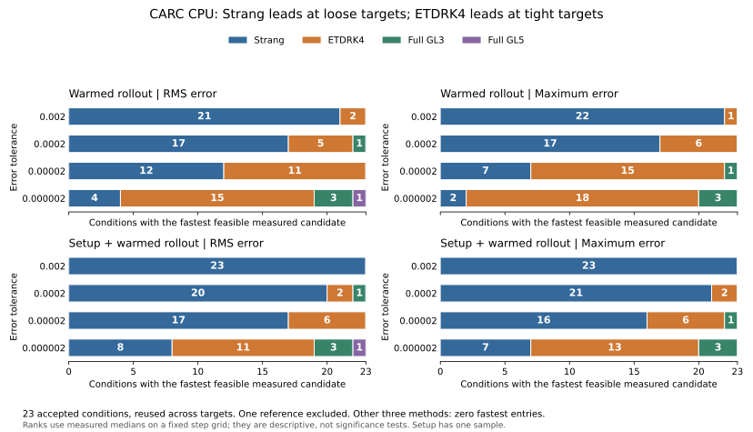

# CARC work–precision review: retain the spatial correction

Job **12698969** validates the spectral mean identity, but the resulting
mean-only solver is never the fastest at a matched target on this bank.
Strang leads at loose tolerances; prepared ETDRK4 leads most tight-tolerance
comparisons. Full GL3 has a smaller, useful set of wins. The next research
target should be an inexpensive spatial correction with honest full-solver
timing, retaining ETDRK4 as a strong control.

The [machine-readable review](../results/carc-work-precision-review.json)
contains artifact hashes, integrity checks, reference exclusions, paired
accuracy/cost summaries, timing caveats and the next-experiment proposal.
This review evaluates uploaded CARC CPU evidence. No new PDE solves or training
were run, and the original artifacts and frozen protocol remain unchanged.

## Verified evidence

- **302 allocated tests passed**, with zero failed, errored or skipped tests.
- **1,008/1,008 candidates** completed with finite, admissible trajectories;
  all **240 identity/rollout parity checks** passed. Numerical execution took
  **64.092 seconds**, and the recorded application runtime was **86.518 seconds**.
- The five science-file seals, completion marker, protocol/configuration hashes
  and execution-source/controller fingerprints match committed source
  `76beb22` (and the identical execution files at `0cedefa`). The reported dirty
  flag is preserved; these checks do not establish a globally clean CARC checkout.
- All **83,449 CSV cells** and **9,105 JSON pointers** verify, including setup
  selections. Native Tower validated 22 output entries, 30 metric records and
  19 log references; 34 schema checks passed. Three exclusions deliberately omit
  cache/work/report directories. No scientific rows were truncated or omitted.
- The requested allocation was four CPUs, 16 GiB and 30 minutes on `main`,
  charged to `anakano_81`, with one intra-op and one inter-op thread. Independent
  scheduler accounting, measured CPU usage and peak RSS are absent from this archive.

## Why the summary remains inconclusive

The same reference as in cloud validation, **`fresh/1d/05`**, exceeds its frozen
precision budget after three refinement attempts. Its observed refinement
order is 4.038, but its RMS uncertainty estimate is `1.14488e-10`, versus the
budget `0.05 * 1e-8 / sqrt(24) = 1.02062e-10`. The maximum-norm estimate is
`5.60873e-10`, versus `5e-10`: about **12.17% over budget**.

This excludes the condition's **56 method/norm/tolerance entries**. Its 42
candidates remain stored, but do not enter accuracy rankings. No acceptance
threshold is relaxed here. A future protocol can allow more bounded refinement
work while preserving the precision criterion.

References solve the same spatially discrete system with refined FP64 RK4.
Their uncertainty and `sqrt(N)`-scaled maximum estimate are refinement
diagnostics, not rigorous certificates or continuum-error estimates.

The other **23 conditions** yield **1,228 feasible entries** and **60 entries
with no feasible tested step count**. The latter comprise Strang 10, ETDRK2 46,
and each mean-only implementation two. ETDRK4, GL3 and GL5 attain every target
for every accepted condition. Spectral mean fails the tightest target in
`fresh/1d/08` under both norms.

## Runtime at equal accuracy

Each table entry counts the fastest reported warmed median among the feasible
methods for **23 accepted conditions**. The same conditions recur across
targets and norms; these are descriptive ranks, not independent trials or
statistical significance claims. Five raw timings accompany each candidate.

| Error norm | Target | Strang fastest | ETDRK4 fastest | GL3 fastest | GL5 fastest |
| --- | ---: | ---: | ---: | ---: | ---: |
| RMS | 0.002 | 21 | 2 | 0 | 0 |
| RMS | 0.0002 | 17 | 5 | 1 | 0 |
| RMS | 0.00002 | 12 | 11 | 0 | 0 |
| RMS | 0.000002 | 4 | 15 | 3 | 1 |
| Maximum | 0.002 | 22 | 1 | 0 | 0 |
| Maximum | 0.0002 | 17 | 6 | 0 | 0 |
| Maximum | 0.00002 | 7 | 15 | 1 | 0 |
| Maximum | 0.000002 | 2 | 18 | 3 | 0 |

ETDRK2 and both mean-only implementations have zero fastest entries.
Including preparation changes the total fastest counts from
**Strang 102 / ETDRK4 73 / GL3 8 / GL5 1** to
**135 / 40 / 8 / 1** over the 184 accepted condition/norm/target combinations.
Strang wins all 23 conditions at the loosest target under both norms when
setup is included. Preparation was measured once; its variance is unknown.

All 1,344 frontier statuses and both independent step selections were
recomputed exactly. Warmed and setup-inclusive selection happen to choose
the same step count within each method in this run; their cross-method winners
still differ because setup costs differ. Selection uses the reference after
measurement and is not a deployable adaptive controller.

### The mean shortcut succeeds algebraically, but not as the leading solver

Spectral evaluation reduces the complete mean-only step from **18 transforms
to three**. Across all 144 same-schedule pairs, its median paired speedup over
full-field mean evaluation is **1.398x warmed** and **1.364x including setup**.
Raw warmed timing ranges are disjoint in 142/144 pairs. This is a sixfold
transform reduction but only about a 1.4-fold runtime gain; transform counts
alone do not predict the cost of this small-grid implementation.

The largest FP64 raw-mean mismatch is `5.69e-19`, and the largest complete
rollout mismatch is `9.99e-16`. FP32 identity differences are at most
`1.75e-10`; that path uses FP64 correction reductions with FP32 FFTs and output.
The archived checks establish absolute differences. Correction/state
denominator magnitudes were not archived, so they do not establish relative
parity errors.

At matched accuracy, spectral mean is slower than Strang in **all 174
common-feasible comparisons**; its median paired runtime is **3.960x** Strang's.
It attains eight targets that Strang misses, but another method is faster on
each. Against ETDRK4 it wins only **9/182** common-feasible warmed comparisons,
and loses all 24 comparisons on the three historical 2D conditions.

### Full GL3 has specific useful regimes; GL5 has one clear exception

GL3 is fastest in eight target entries across **five fresh conditions**.
For example, in `fresh/2d/06` at RMS target `2e-6`, it uses one step and takes
**1.261 ms**; ETDRK4 uses eight steps and takes **2.852 ms**. Strang's eight-step
candidate takes about **1.586 ms**, so the improvement over the next fastest
method is about **1.26x**, rather than the larger ETDRK4-only comparison.

Some wins are marginal. GL3's warmed maximum-error win in `fresh/1d/06` at
`2e-6` is only **2.48%**, with overlapping observed timing ranges. Setup-inclusive
GL3 wins in `fresh/1d/09` and `fresh/2d/06` are also small and have overlapping
shifted ranges. These ranges describe five observations; they are not confidence
intervals and do not include uncertainty in the single setup measurement.

GL5 wins one target: `fresh/1d/06`, RMS `2e-6`. Its one-step error meets the
target, while GL3 needs two steps: **1.581 versus 2.621 ms warmed**, and
**1.985 versus 2.973 ms including setup**. Their observed ranges are disjoint.
GL3 is cheaper on the other **183/184** accepted targets; the paired median
GL5/GL3 cost is **1.315x warmed**. Keep GL5 as a quadrature control, not a default
upgrade.

## What the error says about architecture

Across the 138 accepted condition/schedule pairs, spectral mean improves both
RMS and maximum error over Strang, and full GL3 improves both over spectral
mean. These error separations exceed the descriptive `2 * reference uncertainty`
criterion; this does not turn the paired observations into independent evidence.

At one step, median paired RMS/Strang error is **0.2960** for spectral mean
and **0.04003** for full GL3. Strang's mean bias accounts for a median **91.24%**
of its squared error. After the mean correction, a median **99.9433%** of the
remaining squared error is spatial. At 32 steps, the remaining spatial share
is **99.9962%**. A further uniform correction of these endpoints cannot remove
their spatial residual.

The full correction still does not demonstrate uniform fourth-order time
accuracy. On endpoints above ten times reference uncertainty, late 16-to-32
step apparent-order medians are approximately **2.00** for Strang (23 conditions),
**2.00** for spectral mean (23), **1.88** for GL3 (17), and **3.98** for ETDRK4
(11). These are descriptive resolved subsets, not a new convergence theorem.
All stored error curves decrease over the tested grid; no nonzero error plateau
is established. At 32 steps, ETDRK4 is already within reference uncertainty in
11/23 conditions, so large tiny-error ratios need particular caution.

Eight within-family amplitude comparisons at one step give GL3 residual
empirical two-amplitude log–log slopes of **2.616–3.239**, versus
**2.001–2.071** for Strang. That is consistent
with a useful quadratic correction leaving higher-amplitude interactions.
It supports testing those interactions, not forcing a learned remainder to
start at `h^4`: missing terms can still enter at local order `h^3`.

Two dimensions alone do not determine the winner. GL3 is more accurate than
ETDRK4 in **6/11** 2D conditions at one step, including all four low-amplitude
fresh conditions. ETDRK4 is more accurate on **all three historical 2D controls
at every tested step count**. Keep both the fresh successes and the retained
historical failures in subsequent diagnostics.

## Recommended follow-up

1. **Compress the spatial correction.** Compare a compact representation of
   the full input-derived interaction defect against full GL3, spectral mean,
   Strang and prepared ETDRK4. Separate mean and zero-mean spatial errors; the
   analytic mean is an approximation and must not impose fictitious mass
   conservation or exact nonlinear mean evolution.
2. **Measure implementation cost before scaling training.** Batch or fuse the
   coefficient/reduction operations, then check grid and batch scaling in a
   bounded CPU study. The present grids reach only 40 cells in 1D and 12x12 in
   2D. Neither larger-grid speedups nor GPU benefits follow from these timings.
3. **Preserve amplitude and time-order controls.** Test the compact quadratic
   branch separately from additional finite-amplitude spatial terms. Retain
   GL5's narrow quadrature success and the historical 2D failures. Permit
   additional bounded reference refinement in a new protocol while leaving
   this report's rejected reference unchanged.

This establishes where an interaction-based architecture might help. A claim
against FNO still requires a separate trained comparison with comparable
physical inputs and solver cores, parent-disjoint data, validation-only model
selection and matched complete-rollout accuracy/cost. This review does not
authorize or launch a larger training campaign.
